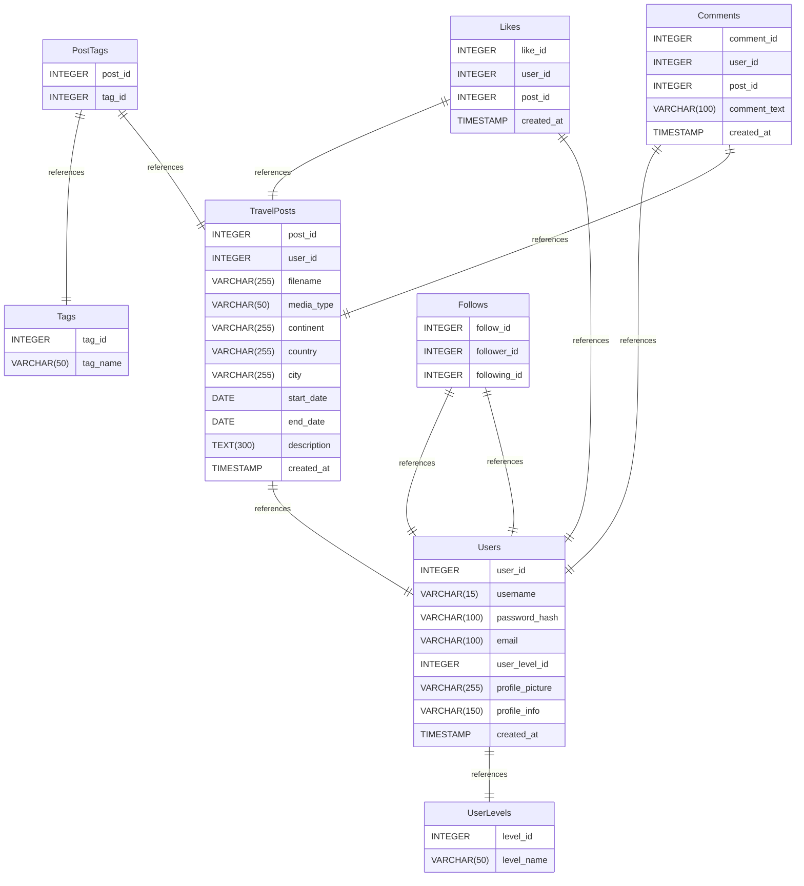

### Backend servers for TravelTime
## here you find authentication, travelpost and upload servers. 

backend was made using node js and express and programmed with typescript

# TravelTime database schema documentation
## Summary

- [Introduction](#introduction)
- [Database Type](#database-type)
- [Table Structure](#table-structure)
    - [UserLevels](#UserLevels)
    - [Users](#Users)
    - [Tags](#Tags)
    - [TravelPosts](#TravelPosts)
    - [PostTags](#PostTags)
    - [Likes](#Likes)
    - [Comments](#Comments)
    - [Follows](#Follows)
- [Relationships](#relationships)
- [Database Diagram](#database-Diagram)

## Introduction

## Database type

- **Database system:** MySQL
## Table structure

### UserLevels

| Name        | Type          | Settings                      | References                    | Note                           |
|-------------|---------------|-------------------------------|-------------------------------|--------------------------------|
| **level_id** | INTEGER | 🔑 PK, not null , unique, autoincrement |  | |
| **level_name** | VARCHAR(50) | not null  |  | | 

### Users

| Name        | Type          | Settings                      | References                    | Note                           |
|-------------|---------------|-------------------------------|-------------------------------|--------------------------------|
| **user_id** | INTEGER | 🔑 PK, not null , unique, autoincrement |  | |
| **username** | VARCHAR(15) | not null , unique |  | |
| **password_hash** | VARCHAR(100) | not null  |  | |
| **email** | VARCHAR(100) | not null , unique |  | |
| **user_level_id** | INTEGER | not null  | fk_Users_user_level_id_UserLevels | |
| **profile_picture** | VARCHAR(255) | not null , default: defaultprofile.png |  | |
| **profile_info** | VARCHAR(150) | not null , default: null |  | |
| **created_at** | TIMESTAMP | not null  |  | | 

### Tags

| Name        | Type          | Settings                      | References                    | Note                           |
|-------------|---------------|-------------------------------|-------------------------------|--------------------------------|
| **tag_id** | INTEGER | 🔑 PK, not null , unique, autoincrement |  | |
| **tag_name** | VARCHAR(50) | not null  |  | | 

### TravelPosts

| Name        | Type          | Settings                      | References                    | Note                           |
|-------------|---------------|-------------------------------|-------------------------------|--------------------------------|
| **post_id** | INTEGER | 🔑 PK, not null , unique, autoincrement |  | |
| **user_id** | INTEGER | not null , unique | fk_TravelPosts_user_id_Users | |
| **filename** | VARCHAR(255) | not null  |  | |
| **media_type** | VARCHAR(50) | not null  |  | |
| **continent** | VARCHAR(255) | not null  |  | |
| **country** | VARCHAR(255) | not null  |  | |
| **city** | VARCHAR(255) | not null  |  | |
| **start_date** | DATE | not null  |  | |
| **end_date** | DATE | not null  |  | |
| **description** | TEXT(300) | not null  |  | |
| **created_at** | TIMESTAMP | not null  |  | | 

### PostTags

| Name        | Type          | Settings                      | References                    | Note                           |
|-------------|---------------|-------------------------------|-------------------------------|--------------------------------|
| **post_id** | INTEGER | not null , unique | fk_PostTags_post_id_TravelPosts | |
| **tag_id** | INTEGER | not null , unique | fk_PostTags_tag_id_Tags | | 

### Likes

| Name        | Type          | Settings                      | References                    | Note                           |
|-------------|---------------|-------------------------------|-------------------------------|--------------------------------|
| **like_id** | INTEGER | 🔑 PK, not null , unique, autoincrement |  | |
| **user_id** | INTEGER | not null , unique | fk_Likes_user_id_Users | |
| **post_id** | INTEGER | not null , unique | fk_Likes_post_id_TravelPosts | |
| **created_at** | TIMESTAMP | not null  |  | | 

### Comments

| Name        | Type          | Settings                      | References                    | Note                           |
|-------------|---------------|-------------------------------|-------------------------------|--------------------------------|
| **comment_id** | INTEGER | 🔑 PK, not null , unique, autoincrement |  | |
| **user_id** | INTEGER | not null , unique | fk_Comments_user_id_Users | |
| **post_id** | INTEGER | not null , unique | fk_Comments_post_id_TravelPosts | |
| **comment_text** | VARCHAR(100) | not null  |  | |
| **created_at** | TIMESTAMP | not null , default: current_timestamp |  | | 

### Follows

| Name        | Type          | Settings                      | References                    | Note                           |
|-------------|---------------|-------------------------------|-------------------------------|--------------------------------|
| **follow_id** | INTEGER | 🔑 PK, not null , unique, autoincrement | fk_Follows_follow_id_Users | |
| **follower_id** | INTEGER | not null , unique | fk_Follows_follower_id_Users | |
| **following_id** | INTEGER | not null , unique |  | | 

## Relationships

- **Users to UserLevels**: one_to_one
- **TravelPosts to Users**: one_to_one
- **PostTags to Tags**: one_to_one
- **PostTags to TravelPosts**: one_to_one
- **Likes to TravelPosts**: one_to_one
- **Likes to Users**: one_to_one
- **Comments to Users**: one_to_one
- **Comments to TravelPosts**: one_to_one
- **Follows to Users**: one_to_one
- **Follows to Users**: one_to_one

## Database Diagram

